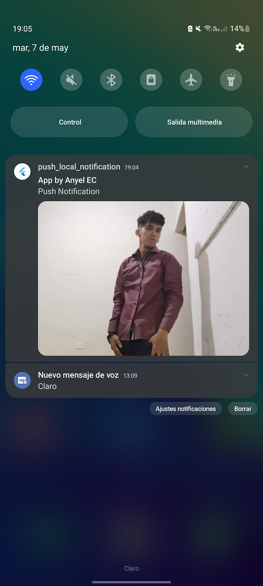
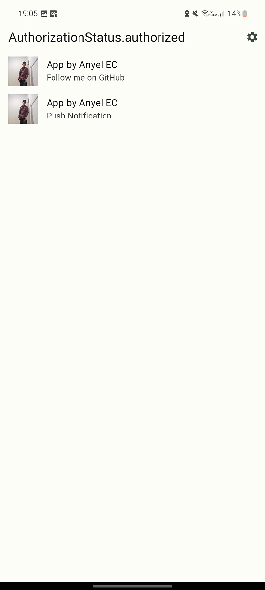
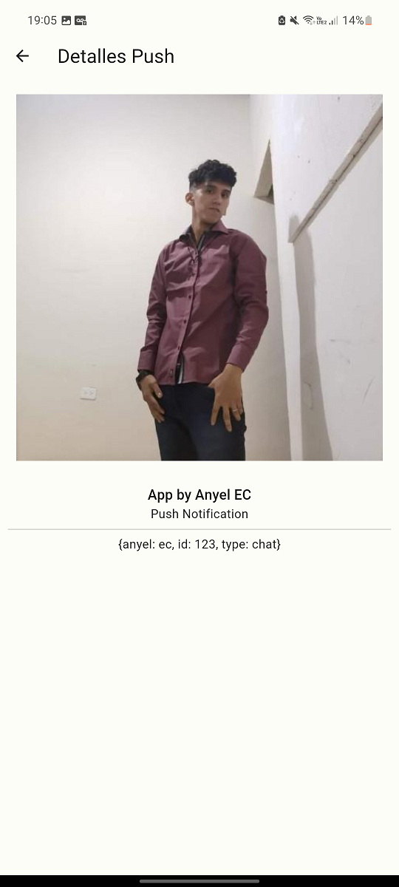

# Proyecto de Notificaciones con Firebase en Flutter

Este proyecto está diseñado para implementar notificaciones push utilizando Firebase Cloud Messaging (FCM) en una aplicación Flutter. Proporciona funcionalidades para recibir notificaciones tanto cuando la aplicación está abierta como cuando está cerrada.

## **Select Language:**
- [Español (Spanish)](README-es.md)
- [English](README.md)

## Result
### Firebase Notification
 
### Notification
 
### Home Screen
 
### Details Screen
 

## Dependencias

A continuación se enumeran las dependencias principales utilizadas en este proyecto:

- **equatable**: ^2.0.5
- **firebase_core**: ^2.30.1
- **firebase_messaging**: ^14.9.1
- **flutter**: sdk: flutter
- **flutter_bloc**: ^8.1.5
- **go_router**: ^14.0.1

## Configuración

1. Asegúrate de tener todas las dependencias mencionadas instaladas en tu proyecto Flutter.
2. Configura tu proyecto en Firebase y descarga el archivo `google-services.json`. Asegúrate de que esté colocado correctamente en la carpeta `android/app` de tu proyecto.
3. Modifica el archivo `firebase_options.dart` con tus opciones de configuración de Firebase.
4. Asegúrate de haber importado correctamente todos los archivos necesarios y configurado las rutas en `app_router.dart`.

## Implementación

El proyecto consta de varias partes clave:

- **main.dart**: Este archivo es el punto de entrada de la aplicación. Aquí se inicializan Firebase y se configura `FirebaseMessaging.onBackgroundMessage` para manejar las notificaciones en segundo plano.
- **notifications_bloc.dart**: Este archivo define el `NotificationsBloc`, que gestiona el estado de las notificaciones y maneja los eventos relacionados con las notificaciones.
- **home_screen.dart**: La pantalla principal de la aplicación, que muestra la lista de notificaciones recibidas y proporciona opciones para configurar las notificaciones.
- **details_screen.dart**: Una pantalla para ver los detalles de una notificación específica.

## Uso

1. Ejecuta la aplicación en un dispositivo o emulador compatible con Flutter.
2. La pantalla principal mostrará las notificaciones recibidas.
3. Puedes tocar una notificación para ver más detalles.
4. Utiliza el icono de configuración en la barra de navegación para ajustar la configuración de las notificaciones.

---

¡Con estos pasos, deberías poder comenzar a desarrollar tu aplicación de notificaciones push en Flutter utilizando Firebase! Si tienes alguna pregunta o necesitas ayuda adicional, no dudes en preguntar.